# Cerebrovascular Accident Prognosis using Supervised Machine Learning Algorithms

> Published Research | Copyright Office New Delhi | Reg. No. SW-16851/2023

## Overview

Cerebral vascular problems such as stroke are a major concern in healthcare due to their
impact on neurological health. This project compares the predictive performance of three
supervised machine learning algorithms — **Random Forest**, **Decision Tree**, and
**XGBoost** — for prognosis of Cerebrovascular Accidents (CVA) using clinical indicators
including age, blood pressure, cholesterol levels, smoking status, and medical history.

**Random Forest achieved the highest accuracy of 99.93%**, outperforming existing
state-of-the-art methods.

---

## Authors

- **Bhalashri Sethuraman** — Assistant Professor, Department of Information Technology, Rajalakshmi Engineering College, Thandalam, India
- **Niveditha S** — Department of Biotechnology, Rajalakshmi Engineering College, Thandalam, India

---

## Research Paper

The full paper is available in [`paper/CVA_Prognosis_Research_Paper.pdf`](paper/CVA_Prognosis_Research_Paper.pdf).

**Keywords:** Cerebrovascular (CVA) Prediction, Decision Tree, Healthcare, Machine Learning, Random Forest, Supervised Learning, XGBoost

---

## Dataset

- **Source:** [Kaggle — Healthcare Dataset Stroke Data](https://www.kaggle.com/datasets/fedesoriano/stroke-prediction-dataset)
- **File:** `healthcare-dataset-stroke-data.csv`
- **Size:** 43,400 instances, 12 features
- **Target variable:** `stroke` (1 = stroke, 0 = no stroke)

> The dataset is **not included** in this repository due to size. Download it from Kaggle and place it in the `data/` folder. See [`data/README.md`](data/README.md).

### Features

| Feature | Type | Description |
|---|---|---|
| `age` | Numerical | Age of the patient |
| `hypertension` | Binary | 0 = No, 1 = Yes |
| `heart_disease` | Binary | 0 = No, 1 = Yes |
| `ever_married` | Categorical | Yes / No |
| `work_type` | Categorical | Private, Self-employed, Govt, Children, Never worked |
| `Residence_type` | Categorical | Urban / Rural |
| `avg_glucose_level` | Numerical | Average glucose level in blood |
| `bmi` | Numerical | Body Mass Index |
| `smoking_status` | Categorical | Never smoked, Formerly smoked, Smokes, Unknown |
| `gender` | Categorical | Male / Female |
| `stroke` | Binary | **Target** — 1 = Stroke detected |

---

## Clinical Classification of CVD

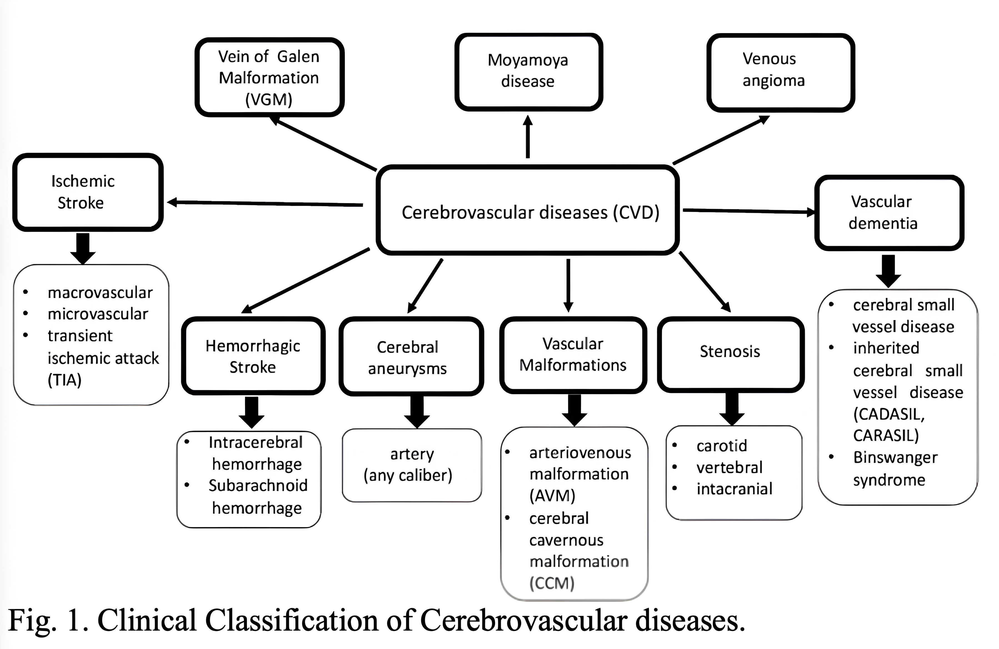

---

## Methodology

### Proposed System Architecture

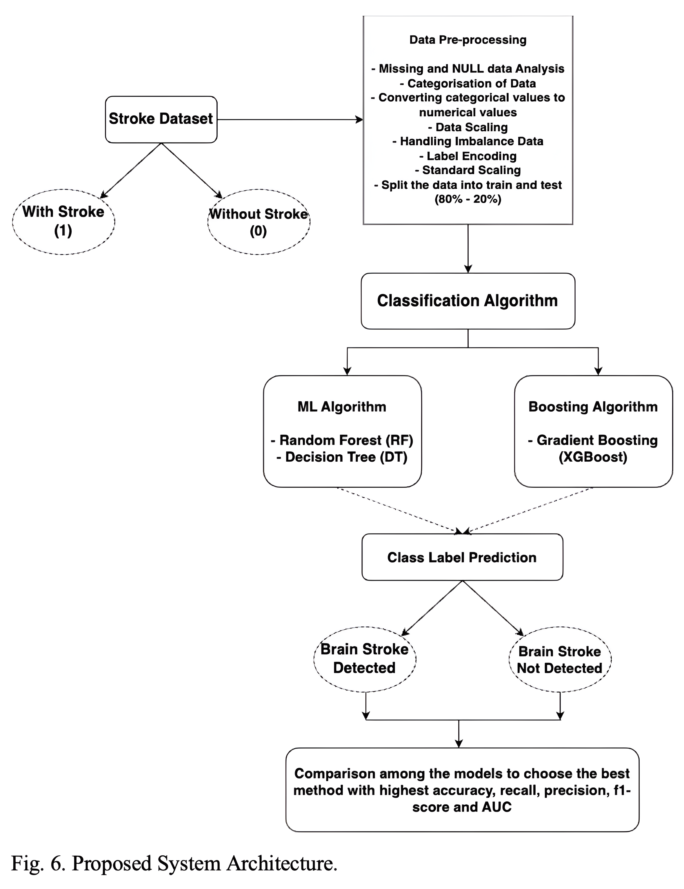

### Data Pipeline

1. **Data Collection** — Clinical stroke dataset from Kaggle
2. **Pre-processing**
   - Removed `id` column
   - Imputed 201 missing BMI values using **median** (to avoid outlier influence)
   - Label encoding for categorical variables
   - One-hot encoding (dummy variables)
   - **RandomOverSampler + SMOTE** to handle class imbalance (~4.9% stroke cases)
   - **StandardScaler** for numerical features (age, BMI, avg glucose level)
3. **Train/Test Split** — 80% training, 20% testing
4. **Model Training** — Decision Tree, XGBoost, Random Forest, KNN, Logistic Regression
5. **Hyperparameter Tuning** — Grid Search / Random Search with validation set
6. **Evaluation** — Accuracy, Precision, Recall, F1-Score, AUC-ROC, Confusion Matrix
7. **K-Fold Cross Validation** — 20 splits (Stratified KFold)

### Exploratory Data Analysis

#### Key Attribute Distributions
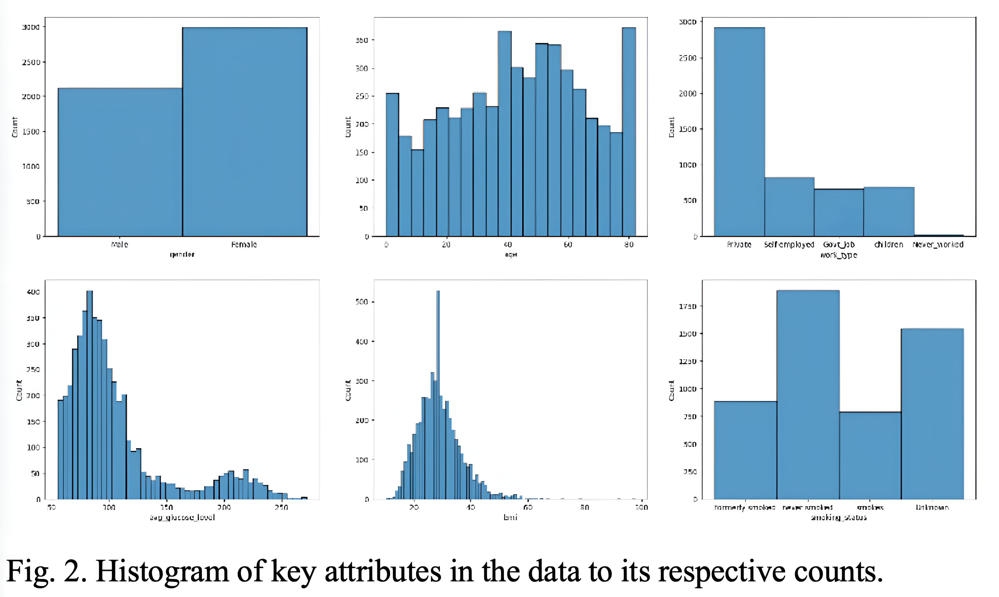

#### BMI Distribution and Outliers
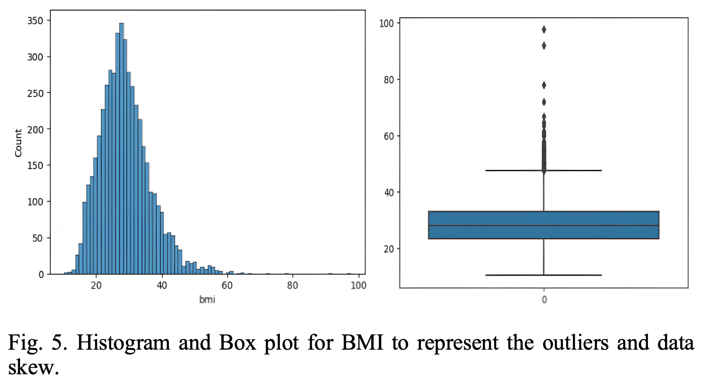

#### Feature Correlation Matrix
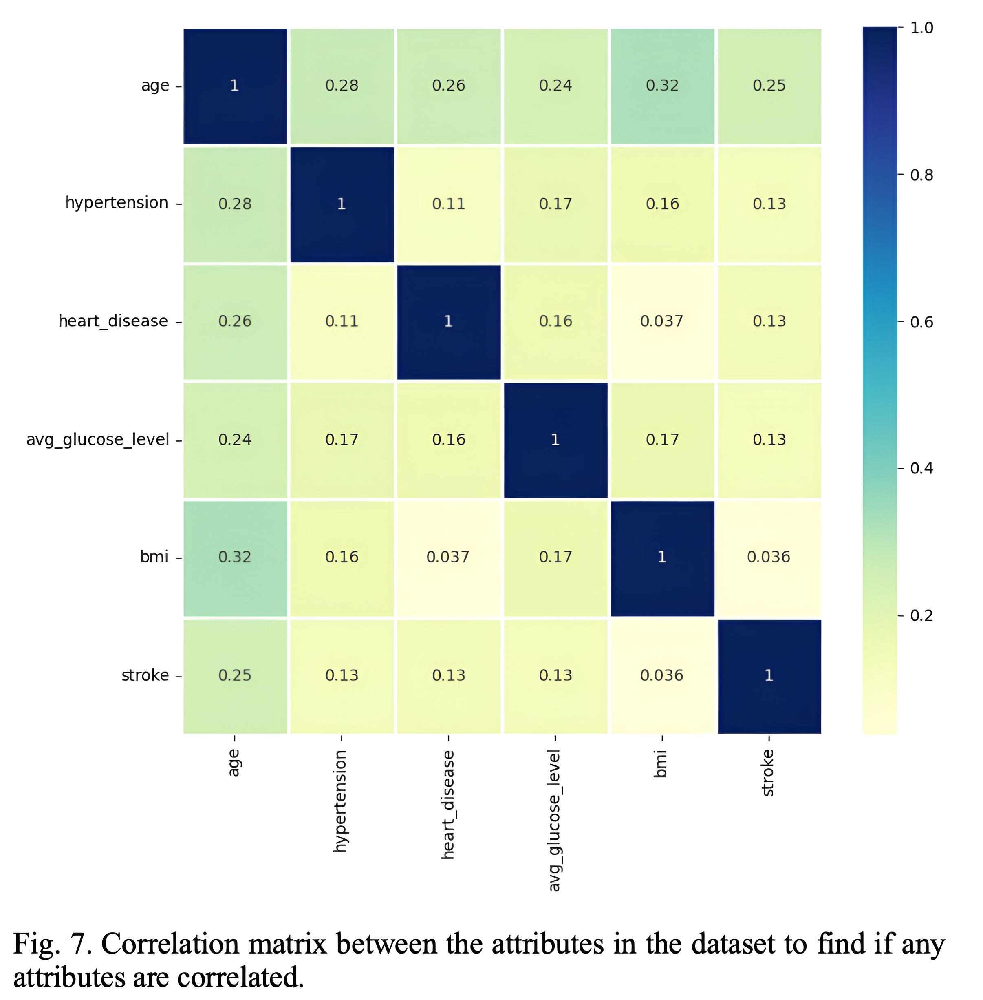

---

## Algorithms

### Random Forest
An ensemble method combining multiple decision trees through bagging and voting.

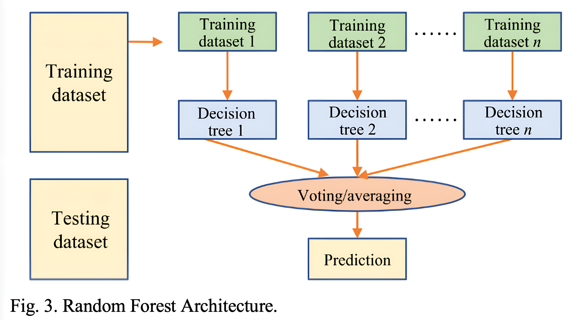

- Robust to overfitting
- Handles high-dimensional feature spaces
- Captures nonlinear relationships

### Decision Tree
Hierarchical model using feature-based split rules.

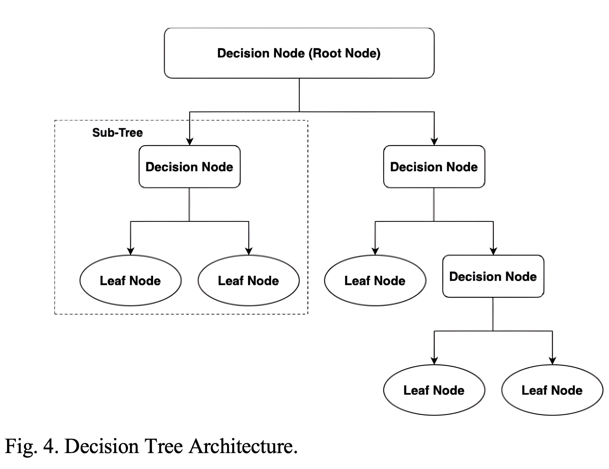

- Interpretable and transparent
- Handles both numerical and categorical data
- Pruning applied to reduce overfitting

### XGBoost
Gradient boosting using weak learners iteratively corrected.

- L1 and L2 regularisation for overfitting control
- Handles missing values natively
- High performance on large datasets

---

## Results

### Model Performance

| Classifier | Existing Accuracy | Proposed Accuracy | ROC AUC |
|---|---|---|---|
| **Random Forest** | 99.87% | **99.93%** | **100.00%** |
| **XGBoost** | 81.18% | **97.94%** | **99.84%** |
| **Decision Tree** | 96.90% | **97.53%** | **97.54%** |

### Data Training-Testing Flowchart

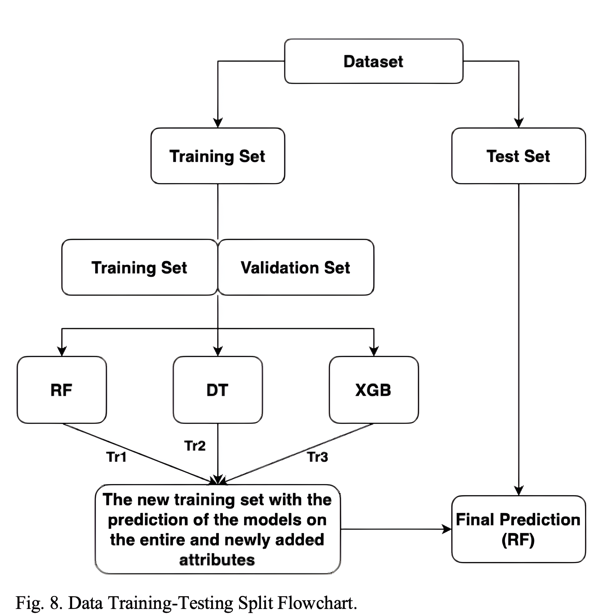

### Random Forest — Confusion Report

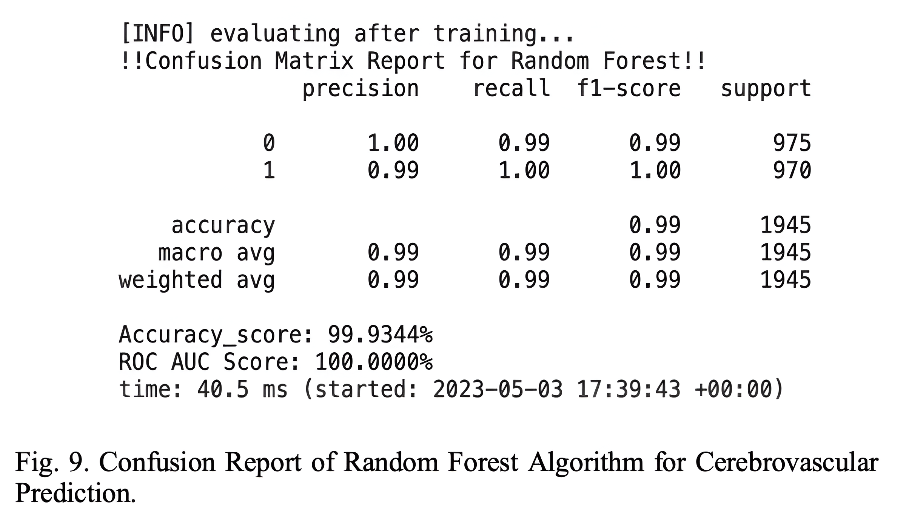

### XGBoost — Confusion Report

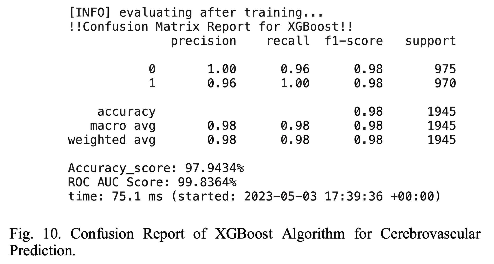

### Decision Tree — Confusion Report

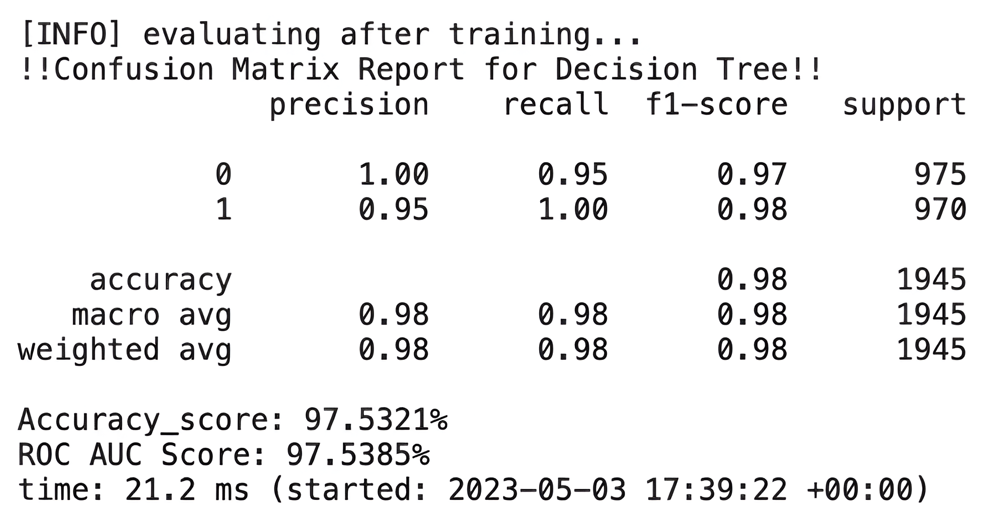

### ROC Curves

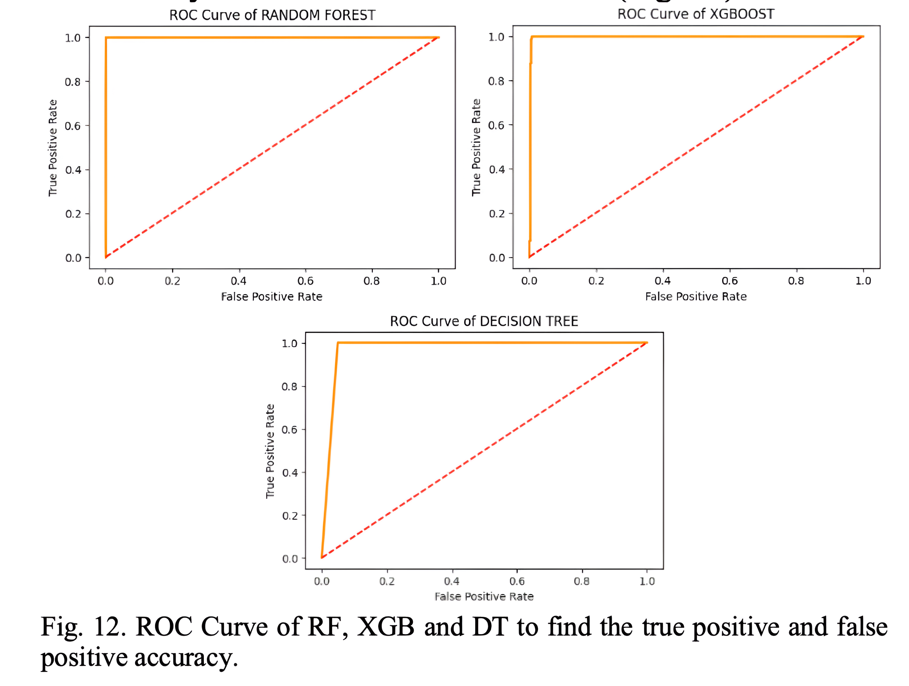

### Confusion Matrices (Visual)

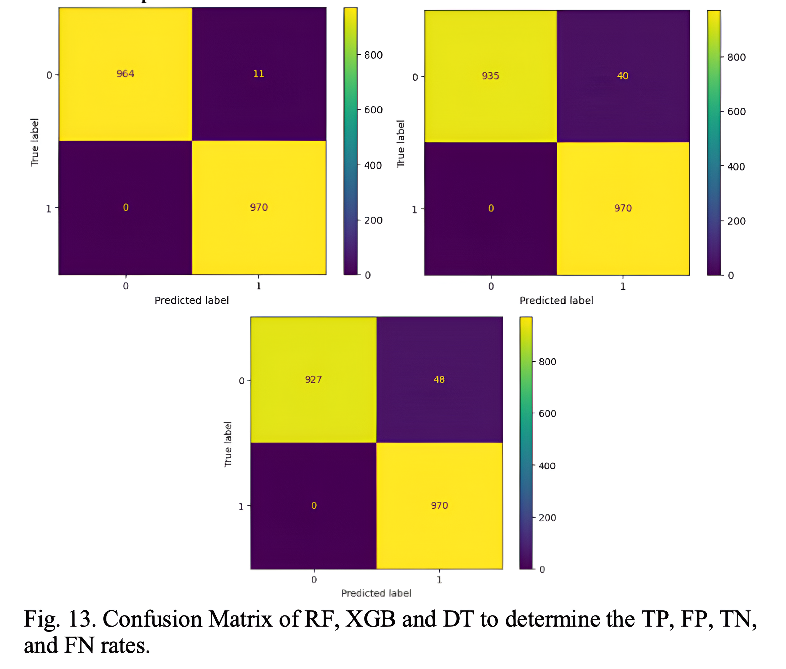

### Accuracy Comparison: Existing vs Proposed

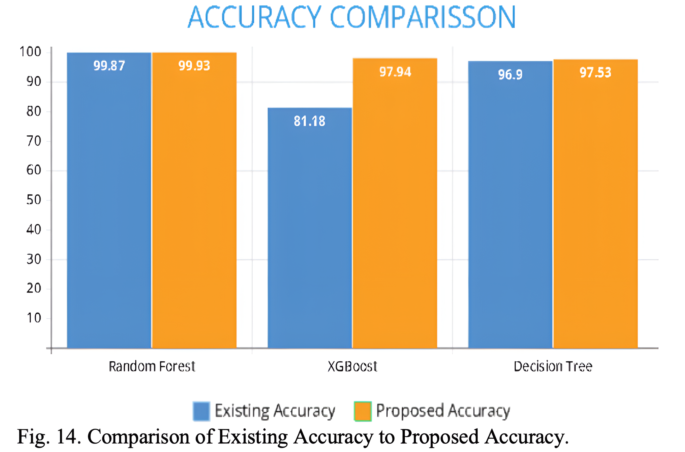

